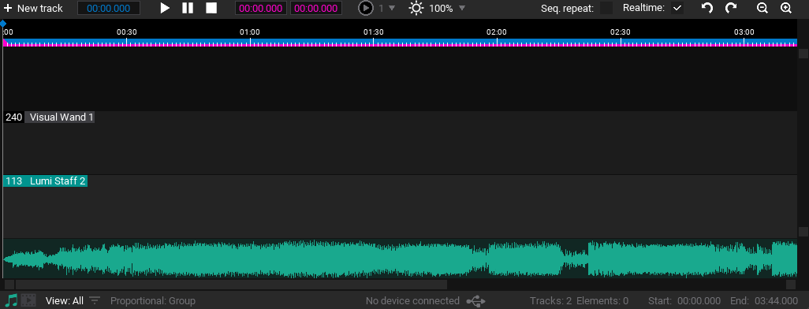
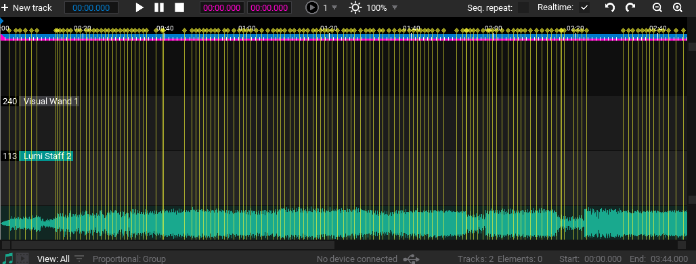
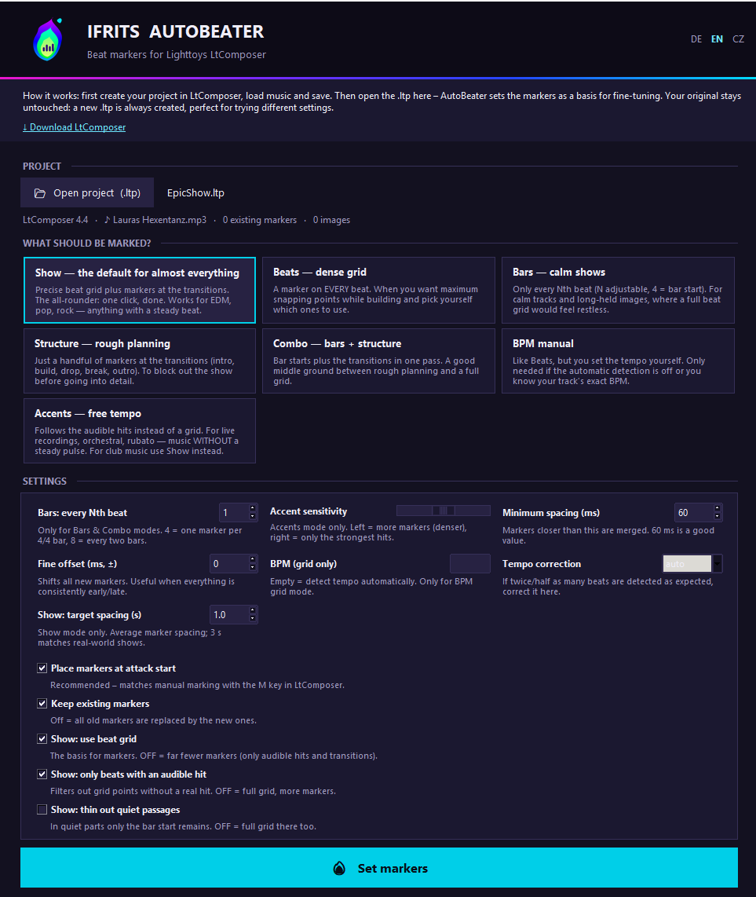
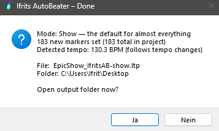

<div align="center">


# Ifrits AutoBeater

**Beat markers for your light show — automatic, not by hand.**

*by [Ifrit Flammenzunge](https://ifritflammenzunge.de/ueber-mich/)*

[](https://github.com/MolyProduction/IfritsAutoBeater/releases/latest)
[](#download)
[](LICENSE)
[](https://www.virustotal.com/gui/file/0f9721601d0641485fabb1ed58bf9c047c440c7c61f018204448225f51ed96ba)

*A free tool from the community, for the community — independent, not an official Lighttoys product.*

🇬🇧 English · [🇩🇪 Deutsch](#deutsch) · [🇨🇿 Česky](#cesky)

**🎯 Right on the beat · 🎬 Your original stays untouched · ⚡ Seconds instead of hours**

</div>

## See the difference

**Before · Vorher · Před** — your empty timeline:



**After · Nachher · Po** — one pass with Ifrits AutoBeater:



## What is it?

<table>
<tr>
<td width="58%" valign="top">

**Ifrits AutoBeater** listens to your show's music and automatically sets **beat markers** in your **Lighttoys LtComposer** project (`.ltp`). Instead of placing every marker by hand, you get a clean marker grid in seconds as a starting point — then shape your show as usual in LtComposer.

The music is analyzed and the markers are written into a **new** project file — **your original stays untouched**. The output name shows the settings used, e.g. `Show_IfritsAB-takte4.ltp` (bars, every 4th beat) or `Show_IfritsAB-bpm128.ltp` (grid).

</td>
<td width="42%" valign="top">

</td>
</tr>
</table>

> The automatic results aren't always perfect, but they give you a solid starting point for further shaping in LtComposer.

> **💡 New to LtComposer?**
> **LtComposer** is the free Lighttoys software for creating light shows on their LED props — poi, staves, buugeng and more. You build your show on a timeline; **markers** help you land your light changes right on the music. Ifrits AutoBeater is a companion that prepares those markers for you.
>
> **➜ Get LtComposer:** [lighttoys.cz/software](https://www.lighttoys.cz/software/)

<a name="download"></a>

## ⬇️ Download & getting started

<div align="center">

[](https://github.com/MolyProduction/IfritsAutoBeater/releases/latest/download/IfritsAutoBeaterV42.zip)

</div>

1. Download the ZIP (button above or from **[Releases](https://github.com/MolyProduction/IfritsAutoBeater/releases/latest)**).
2. **Extract** the ZIP (contains `IfritsAutoBeater.exe` and this README).
3. Double-click `IfritsAutoBeater.exe` — **Windows only**.
4. Since the app isn't signed with an (expensive) Microsoft certificate, Windows warns you on first launch: **"More info" → "Run anyway"** — that's it.

## 🔒 Security

The app is an unsigned Windows EXE packaged with Python (librosa) — files like this can occasionally trigger a false positive in a single scanner. You can verify the file yourself. **Important:** the VirusTotal report and checksum are for the **EXE**, so verify **after extracting**.

- **VirusTotal report (EXE):** [view file](https://www.virustotal.com/gui/file/0f9721601d0641485fabb1ed58bf9c047c440c7c61f018204448225f51ed96ba)
- **SHA-256 of `IfritsAutoBeater.exe`** (must match after extraction):
  ```
  0f9721601d0641485fabb1ed58bf9c047c440c7c61f018204448225f51ed96ba
  ```
  Verify on Windows (PowerShell): `Get-FileHash .\IfritsAutoBeater.exe -Algorithm SHA256`

## How to use

<table>
<tr>
<td width="58%" valign="top">

1. Select your `.ltp` project (music must be loaded in the project).
2. Pick a mode.
3. Click **"Set markers"**.
4. Open the new file in LtComposer — done.

*A short summary tells you how many markers were set and which tempo was detected.*

</td>
<td width="42%" valign="top">

</td>
</tr>
</table>

## Modes

| Mode | Result |
|---|---|
| **Show** ⭐ | Precise beat grid + transitions. The default for almost everything — one click, done |
| **Beats** | A marker on every beat — maximum snapping points while building |
| **Bars** | Only every Nth beat — for calm tracks and long-held images |
| **Structure** | Few markers at the transitions — to block out the show |
| **Combo** | Bar starts + transitions combined |
| **BPM manual** | Like Beats, but you set the tempo yourself |
| **Accents** | Follows audible hits instead of a grid — for live/orchestral/rubato without a steady pulse |

## Tips

- **Markers slightly off?** Set a fine offset (±ms) and run again — or select all markers in LtComposer with Shift-click and move them together.
- **Double/half tempo detected?** Set tempo correction to "half" or "double".
- **Too many/too few accents?** Use the sensitivity slider (right = fewer, only strong accents).
- Existing markers are kept by default; untick the checkbox to replace them.

📜 The full version history is in the **[CHANGELOG](CHANGELOG.md)**.

*Bilder oben gelten für alle Sprachen. · Obrázky výše platí pro všechny jazyky.*

---

<a name="deutsch"></a>
<details>
<summary><b>🇩🇪 Deutsch — zum Aufklappen klicken</b></summary>

<br>

**Beat-Marker für deine Lichtshow – automatisch statt mühsam von Hand.**

*Ein kostenloses Tool aus der Community, für die Community – unabhängig, kein offizielles Lighttoys-Produkt.*
(Die Screenshots und der Vorher/Nachher-Vergleich stehen oben.)

### Was ist das?

**Ifrits AutoBeater** hört sich die Musik deiner Show an und setzt automatisch **Beat-Marker** in dein **Lighttoys-LtComposer-Projekt** (`.ltp`). Statt jeden Marker von Hand zu setzen, bekommst du in Sekunden ein sauberes Marker-Raster als Ausgangslage – den Rest deiner Show gestaltest du danach wie gewohnt im LtComposer.

Die Musik wird analysiert und die Marker in eine **neue** Projektdatei geschrieben – **dein Original bleibt unangetastet**. Der Ausgabename zeigt die benutzten Einstellungen, z. B. `Show_IfritsAB-takte4.ltp` (Takte, jeder 4. Beat) oder `Show_IfritsAB-bpm128.ltp` (Raster).

> Die automatischen Ergebnisse sind nicht immer perfekt, bieten aber eine gute Ausgangslage für die weitere Bearbeitung im LtComposer.

> **💡 LtComposer noch nicht bekannt?**
> **LtComposer** ist die kostenlose Lighttoys-Software zum Erstellen von Lichtshows auf ihren LED-Requisiten – Poi, Stäbe, Buugeng und mehr. Du baust deine Show auf einer Zeitleiste; **Marker** helfen dir, deine Lichtwechsel genau auf die Musik zu setzen. Ifrits AutoBeater ist eine Ergänzung, die dir diese Marker vorbereitet.
>
> **➜ LtComposer holen:** [lighttoys.cz/software](https://www.lighttoys.cz/software/)

### ⬇️ Download & Start

**[➜ IfritsAutoBeaterV42.zip herunterladen](https://github.com/MolyProduction/IfritsAutoBeater/releases/latest/download/IfritsAutoBeaterV42.zip)** (oder unter [Releases](https://github.com/MolyProduction/IfritsAutoBeater/releases/latest))

1. ZIP herunterladen.
2. ZIP **entpacken** (enthält `IfritsAutoBeater.exe` und diese README).
3. Doppelklick auf `IfritsAutoBeater.exe` — **nur Windows**.
4. Da die App nicht mit einem (teuren) Microsoft-Zertifikat signiert ist, meldet sich Windows beim ersten Start: **„Weitere Informationen" → „Trotzdem ausführen"** — das war's.

### 🔒 Sicherheit

Die App ist eine unsignierte, mit Python (librosa) gepackte Windows-EXE – bei solchen Dateien kann es zu vereinzelten Fehlalarmen einzelner Scanner kommen. Du kannst die Datei selbst überprüfen. **Wichtig:** VirusTotal-Report und Prüfsumme gelten für die **EXE**; prüfe sie also erst **nach dem Entpacken**.

- **VirusTotal-Report (EXE):** [Datei ansehen](https://www.virustotal.com/gui/file/0f9721601d0641485fabb1ed58bf9c047c440c7c61f018204448225f51ed96ba)
- **SHA-256 der `IfritsAutoBeater.exe`**:
  ```
  0f9721601d0641485fabb1ed58bf9c047c440c7c61f018204448225f51ed96ba
  ```
  Prüfen unter Windows (PowerShell): `Get-FileHash .\IfritsAutoBeater.exe -Algorithm SHA256`

### So benutzt du es

1. `.ltp`-Projekt wählen (die Musik muss im Projekt geladen sein).
2. Modus wählen.
3. **„Marker setzen"** klicken.
4. Neue Datei im LtComposer öffnen — fertig.

*Eine kurze Zusammenfassung zeigt dir, wie viele Marker gesetzt wurden und welches Tempo erkannt wurde.*

### Modi

| Modus | Ergebnis |
|---|---|
| **Show** ⭐ | Präzises Beat-Raster + Übergänge. Standard für fast alles — einmal klicken, fertig |
| **Beats** | Marker auf jedem Schlag — maximale Einrast-Punkte beim Bauen |
| **Takte** | Nur jeder N-te Schlag — für ruhige Stücke und lange Bilder |
| **Struktur** | Wenige Marker an den Übergängen — zum Aufteilen der Show |
| **Kombi** | Taktanfänge + Übergänge zusammen |
| **BPM manuell** | Wie Beats, aber mit selbst gesetztem Tempo |
| **Akzente** | Folgt hörbaren Schlägen statt Raster — für Live/Orchester/Rubato ohne festes Metrum |

### Tipps

- **Marker sitzen knapp daneben?** Feinversatz (±ms) einstellen und erneut ausführen — oder im LtComposer alle Marker per Shift-Klick auswählen und gemeinsam verschieben.
- **Doppeltes/halbes Tempo erkannt?** Tempo-Korrektur auf „halb" oder „doppelt" stellen.
- **Zu viele/wenige Akzente?** Empfindlichkeit-Regler nutzen (rechts = weniger, nur starke Akzente).
- Vorhandene Marker bleiben standardmäßig erhalten; Häkchen entfernen, um sie zu ersetzen.

📜 Vollständige Versionshistorie im **[CHANGELOG](CHANGELOG.md)**.

[🔝 nach oben](#ifrits-autobeater)

</details>

<a name="cesky"></a>
<details>
<summary><b>🇨🇿 Česky — kliknutím rozbalíte</b></summary>

<br>

**Beat markery pro tvou světelnou show – automaticky, ne ručně.**

*Bezplatný nástroj z komunity, pro komunitu – nezávislý, není to oficiální produkt Lighttoys.*
(Screenshoty a srovnání před/po najdeš výše.)

### Co to je?

**Ifrits AutoBeater** poslouchá hudbu tvé show a automaticky vloží **beat markery** do tvého projektu **Lighttoys LtComposer** (`.ltp`). Místo ručního nastavování každého markeru dostaneš během pár sekund čistou mřížku markerů jako výchozí bod — zbytek show pak vytvoříš jako obvykle v LtComposeru.

Hudba se analyzuje a markery se zapíší do **nového** projektového souboru — **originál zůstane nedotčen**. Název výstupu ukazuje použitá nastavení, např. `Show_IfritsAB-takte4.ltp` (takty, každý 4. beat) nebo `Show_IfritsAB-bpm128.ltp` (mřížka).

> Automatické výsledky nejsou vždy dokonalé, ale poskytují dobrý výchozí bod pro další úpravy v LtComposeru.

> **💡 Neznáš LtComposer?**
> **LtComposer** je bezplatný software od Lighttoys pro tvorbu světelných show na jejich LED rekvizitách – poi, tyče, buugeng a další. Show stavíš na časové ose; **markery** ti pomohou umístit světelné změny přesně na hudbu. Ifrits AutoBeater je doplněk, který ti tyto markery připraví.
>
> **➜ Získat LtComposer:** [lighttoys.cz/software](https://www.lighttoys.cz/software/)

### ⬇️ Stažení a spuštění

**[➜ Stáhnout IfritsAutoBeaterV42.zip](https://github.com/MolyProduction/IfritsAutoBeater/releases/latest/download/IfritsAutoBeaterV42.zip)** (nebo v sekci [Releases](https://github.com/MolyProduction/IfritsAutoBeater/releases/latest))

1. Stáhni ZIP.
2. ZIP **rozbal** (obsahuje `IfritsAutoBeater.exe` a tuto README).
3. Dvojklik na `IfritsAutoBeater.exe` — **pouze Windows**.
4. Protože aplikace není podepsána (drahým) certifikátem od Microsoftu, Windows se při prvním spuštění ozve: **„Další informace" → „Přesto spustit"** — a je to.

### 🔒 Bezpečnost

Aplikace je nepodepsané Windows EXE zabalené pomocí Pythonu (librosa) — u takových souborů může výjimečně jeden skener nahlásit falešný poplach. Soubor si můžeš sám ověřit. **Důležité:** report VirusTotal a kontrolní součet platí pro **EXE**, ověřuj tedy až **po rozbalení**.

- **Report VirusTotal (EXE):** [zobrazit soubor](https://www.virustotal.com/gui/file/0f9721601d0641485fabb1ed58bf9c047c440c7c61f018204448225f51ed96ba)
- **SHA-256 souboru `IfritsAutoBeater.exe`**:
  ```
  0f9721601d0641485fabb1ed58bf9c047c440c7c61f018204448225f51ed96ba
  ```
  Ověření ve Windows (PowerShell): `Get-FileHash .\IfritsAutoBeater.exe -Algorithm SHA256`

### Použití

1. Vyber projekt `.ltp` (hudba musí být v projektu načtena).
2. Zvol režim.
3. Klikni na **„Nastavit markery"**.
4. Otevři nový soubor v LtComposeru — hotovo.

*Krátké shrnutí ti ukáže, kolik markerů bylo nastaveno a jaké tempo bylo rozpoznáno.*

### Režimy

| Režim | Výsledek |
|---|---|
| **Show** ⭐ | Přesná beatová mřížka + přechody. Výchozí pro téměř vše — jeden klik a hotovo |
| **Beaty** | Marker na každé době — maximum bodů pro přichytávání při stavbě |
| **Takty** | Jen každá N-tá doba — pro klidné skladby a dlouhé obrazy |
| **Struktura** | Málo markerů na přechodech — pro rozvržení show |
| **Kombinace** | Začátky taktů + přechody dohromady |
| **BPM ručně** | Jako Beaty, ale tempo zadáš sám |
| **Akcenty** | Sleduje slyšitelné údery místo mřížky — pro živé/orchestrální/rubato bez pevného pulzu |

### Tipy

- **Markery sedí těsně vedle?** Nastav jemný posun (±ms) a spusť znovu — nebo v LtComposeru vyber všechny markery pomocí Shift-kliknutí a posuň je společně.
- **Rozpoznáno dvojité/poloviční tempo?** Nastav korekci tempa na „poloviční" nebo „dvojité".
- **Příliš mnoho/málo akcentů?** Použij posuvník citlivosti (doprava = méně, jen silné akcenty).
- Stávající markery zůstávají ve výchozím nastavení zachovány; pro nahrazení odškrtni políčko.

📜 Kompletní historie verzí v souboru **[CHANGELOG](CHANGELOG.md)**.

[🔝 nahoru](#ifrits-autobeater)

</details>

---

<div align="center">

**Ifrits AutoBeater** — created by **[Ifrit Flammenzunge](https://ifritflammenzunge.de/ueber-mich/)** · a tool from the community, for the community
Questions & support: [Github Issues](https://github.com/MolyProduction/IfritsAutoBeater/issues) or [ifritflammenzunge.de](https://ifritflammenzunge.de/ueber-mich/) · LtComposer software: [lighttoys.cz/software](https://www.lighttoys.cz/software/)

</div>
